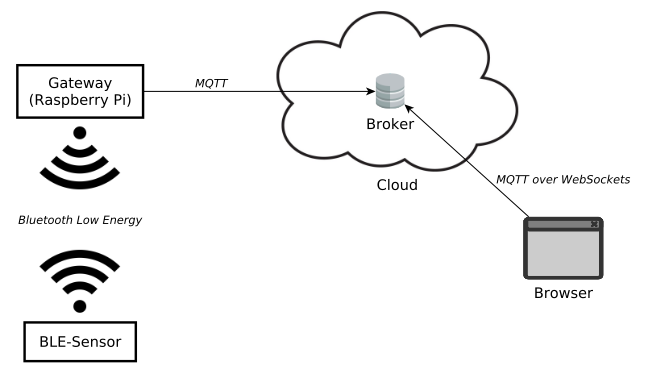

### Temperature Over MQTT

### Summary

The MQTT_Gateway software aquires data from a bluetooth-low-energy sensor and sends them to a MQTT broker.

Our sensor is equiped with a temperature sensor, an accelerometer and a gyroscope.

The Website gets the data from the broker and visualizes the aquired data using google graphs. 

  

### Contributors

* id101010
* ingmacmech
* sches8
